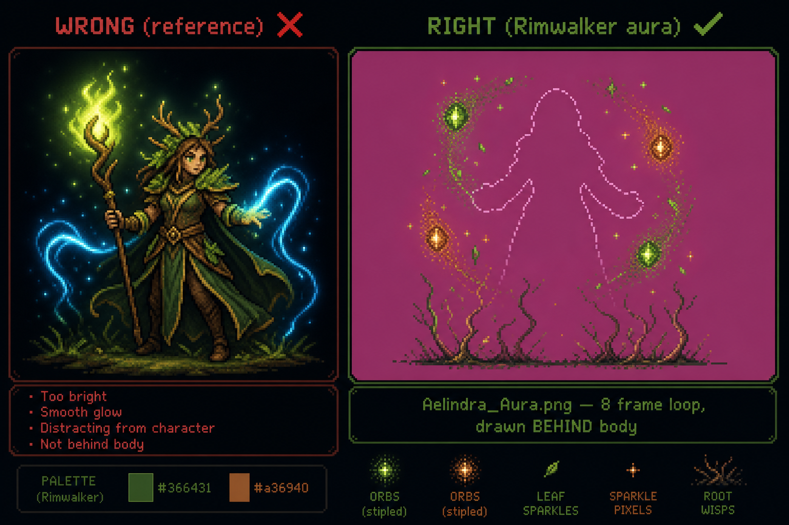

# Aelindra — Persistent Aura VFX (“Tendkeeper’s Wake”)

**Goal:** A looping effect that *lives on* Aelindra — orbiting earth motes, root wisps, leaf sparkles — like the reference mood, but **Rimwalker-correct**.

Reference mood: swirling green orbs + energy trails + soft glow around the hero.  
Rimwalker rule: power rises from the **earth around her**, never from her hands or staff tip.

---

## Reference → Rimwalker translation

| Reference (what you showed) | Rimwalker version |
|----------------------------|-------------------|
| Green flame on staff tip | **No.** Staff stays wood + amber gem only. Gem may pulse subtly (1–2 px amber flicker max). |
| Blue/cyan energy wisps | **Forest green + amber** only (`#366431`, `#46534a`, `#a36940`) |
| White hair | Keep Aelindra canon: **black braided hair**, antler crown |
| Smooth glow / galaxy orbs | **Stipple pixel orbs** — small earth motes, 8–16 px, dithered edges |
| Effect from hands | Wisps rise from **ground at her feet** and orbit **waist/shoulder height** |
| Always maximal | **Quiet idle** — 3–4 motes. **Intensifies** during Verdant Pulse cast only |

---

## Render order (engine)

```
1. shadow
2. Aelindra_Aura.png loop  ← behind body, follows unit position
3. Aelindra body strip     ← idle / walk / cast
4. health bar / UI
```

Same pattern as monk `heal_effect` in `src/sprites.js`, but:
- Drawn **before** the body frame (underlay, not overlay)
- **Loops always** while alive (`speed: 6`)
- Hidden on death / reduced motion

---

## Asset spec

| Field | Value |
|-------|-------|
| File | `assets/heroes/rimwalker/aelindra/Aelindra_Aura.png` |
| Frames | **8** (loop) |
| Frame size | **256×256** per frame |
| Strip size | **2048×256** |
| Anchor | Centered on character torso; feet align with body strips |
| Background | Transparent (export from keyed magenta source) |
| Layer | **VFX only** — no character silhouette in strip |

### What each frame contains

- **3–5 small earth motes** orbiting at different radii (elliptical paths, staggered phase)
- **2–3 thin root-wisp curves** rising from bottom third of frame (ground origin)
- **Sparse leaf-spark pixels** (single-pixel stipple, not star particles)
- **No staff, no body, no face** — aura-only plate

---

## Google Flow — aura loop video (Step A.1)

| | |
|---|---|
| **Flow** | Video · **4:3** or **16:9** · **x1** |
| **Reference** | Approved **south idle** as Image 1 (scale lock only — aura is separate layer) |

**Positive:**
```
Aelindra Tendkeeper aura VFX overlay ONLY — no character body, no face, no staff silhouette. Empty center where hero body will be drawn in engine. Small stipple pixel earth motes in forest green #366431 and amber #a36940 orbiting in elliptical paths around center waist height. Thin root-wisp curves rising from bottom of frame from ground level only — not from hands. Sparse single-pixel leaf sparkles. Warcrest pixel art, Valdris idiom, selective outline #110509 on orb edges, dither shading, no smooth gradients. Magenta #FF00FF background. 8-frame seamless loop, subtle slow motion. Scale-to-fit inside centered 1:1 square matching Image 1 foot baseline — identical scale to south idle, do not zoom to fill wide canvas. Magenta letterbox on sides. Quiet idle intensity — 3 to 4 motes only, not overwhelming.
```

**Negative:**
```
character body, face, staff, hands, arms, legs, hair, cloak silhouette, photorealistic, 3D render, CGI, smooth gradients, blue, cyan, sky blue, gold, white hair, fire from staff, flame on staff tip, particles from hands, spell beam, magic explosion, lens flare, bloom, motion blur, depth of field, text, watermark, zoom to fill, crop to fill, enlarged VFX, tiny VFX, white background
```

**ffmpeg (8 frames → square):**
```bash
ffmpeg -i aelindra_aura.mp4 -ss 0.1 -t 1.0 \
  -vf "fps=8,scale=1024:1024:force_original_aspect_ratio=decrease:flags=lanczos,pad=1024:1024:(ow-iw)/2:(oh-ih)/2:color=0xFF00FF" \
  frames/aura_%02d.png
convert +append frames/aura_*.png aura_strip.png
```

**sprite-tool:** Animation tab · clip name `Aelindra_Aura` · Key · Hero · 256 · Pixelize · export.

---

## Engine wiring (when asset ships)

**`src/sprites.js` — add to `aelindra.clips`:**
```js
aura: { file: 'Aelindra_Aura.png', count: 8, speed: 6 },
```

**`src/sprites.js` — draw before body in `drawUnit`:**
```js
if (u.heroId === 'aelindra' && sheet.clips.aura) {
  this.drawAuraEffect(ctx, u, s, sheet);  // underlay, uses u._idlePhase
}
drawSpriteFrame(ctx, clip, sheet, fi, u, ...);
```

**Intensity hook (optional later):**
- Idle: `globalAlpha 0.55`
- Casting `cast_verdant`: `globalAlpha 0.9`
- Death: fade aura with corpse timer

---

## Production checklist

- [ ] Generate aura video (body-less VFX plate)
- [ ] ffmpeg → 8 square frames → strip
- [ ] sprite-tool pixelize → `Aelindra_Aura.png`
- [ ] Verify: overlay on south idle in Aseprite — motes orbit torso, nothing clips staff read
- [ ] Wire `aura` clip + `drawAuraEffect` in `sprites.js`
- [ ] Test beside Valdris — aura should feel present but not steal silhouette

---

## Quick visual (what “lives on her” means)

```
        ✦  mote
    ～～～～～  root wisp from ground
       ┌───┐
       │   │  ← body drawn by engine (NOT in aura strip)
       │   │
      ─┴───┴─  feet baseline
    ✦     ✦   motes at waist height
```

The aura strip is the `✦` and `～` only. The character is drawn separately on top.



---

*Pairs with [`aelindra_animation_manifest.md`](./aelindra_animation_manifest.md) — body clips stay clean; this is the first **unit-attached** loop VFX.*
