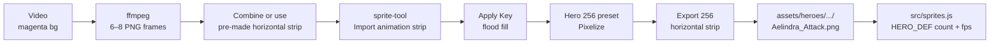

# Rimwalker Animation Workflow — Flow Sheet

**Video → frames → sprite-tool → engine strip**

Use this for **body clips** (attack, cast, idle loop, death). For **cardinal walk/idle directions**, use the 4-direction strip path instead (see bottom).

Full Google Flow prompts: [`google_flow_cheat_sheet.md`](./google_flow_cheat_sheet.md#master-prompt) · idle anchors use the base master prompt; **attack/cast videos** use the variant below.

---

## Master prompt for attack videos

When generating attack/cast clips in Google Flow (before ffmpeg → sprite-tool), use the **[master prompt](./google_flow_cheat_sheet.md#master-prompt)** with these slot overrides:

| Slot | Attack / cast video value |
|------|---------------------------|
| `{POSE_TYPE}` | `animated {ABILITY_NAME} sequence, 6–8 frames of motion, body motion only, no baked VFX in clip, grounded body motion, same prop hand every frame` |
| `{DIRECTION}` | `south` (single-facing animation strips) |

**Consistency anchors (same as idle):** 1024×1024 · flat `#FF00FF` magenta · character 85–90% frame height · high top-down 3/4 · selective outline `#110509` · Aelindra palette family (no blue, no gold) · stipple/dither · match south idle bbox/framing.

**Video in a 1:1 frame (match image dimensions):** Flow video is **4:3 or 16:9 only** — there is no 1:1 video option. Keep the character in the **same centered 1024×1024 box** as your 1:1 image anchors:

1. **Flow UI:** Video · **4:3** (preferred) or **16:9** · **x1** · upload **south idle as Image 1**
2. **Prompt** — append to every video generation:

```
Scale-to-fit inside a centered 1:1 square matching the south idle image — identical character scale as Image 1, same foot baseline, same headroom. Full body head to feet fits inside the square with margin; do not zoom in, do not scale up to fill the wide canvas, do not crop head or feet. Flat magenta #FF00FF letterbox bars on left and right of the 1:1 safe zone. No zoom change, no reframing between frames, no camera move.
```

3. **ffmpeg** — pad every extracted frame to **1024×1024** (identical to image anchor size):

```bash
ffmpeg -i clip.mp4 -ss 0.1 -t 1.0 \
  -vf "fps=8,scale=1024:1024:force_original_aspect_ratio=decrease:flags=lanczos,pad=1024:1024:(ow-iw)/2:(oh-ih)/2:color=0xFF00FF" \
  frames/frame_%02d.png
```

4. **Verify:** place `frame_01.png` next to south idle — same character height and foot line before pixelize.

**Aelindra body-only rule:** Power comes from the **ground at destination** — never from her hands. For body strips, negative prompt must include `VFX spawning from hands, roots from hands, fire from hands, baked VFX`. Spell VFX always go in a **separate** strip (composited in-engine at `impactFrame`); trim ffmpeg output to manifest frame count (4/5/6/10) before pixelize.

**Example add-on** (append after filled master prompt for Root Lash):

> staff base tapping ground strike pose, no roots from hands, 4-frame attack read, impact on mid-frame

---

## Quick checklist

- [ ] Source video on **magenta / chroma green** background (flat, no shadows on backdrop)
- [ ] **Option A:** sprite-tool **Animation** tab → **Import video (MP4)** · set frame count + trim · auto-pick frames
- [ ] **Option B:** ffmpeg extract → stitch strip → **Import animation strip**
- [ ] Open `~/ComfyUI-Sprites/sprite-tool/sprite-tool.html` in Chrome/Safari
- [ ] **Import animation strip** (or drop file with `attack` / `cast` / `anim` in name)
- [ ] Set **clip name** → e.g. `Aelindra_Attack` (becomes export filename)
- [ ] **Apply Key** (flood fill, tolerance ~30)
- [ ] Click **Hero · 256** preset → **Pixelize**
- [ ] Export scale **256** → **Animation strip** → `Aelindra_Attack.png`
- [ ] Copy to `assets/heroes/rimwalker/aelindra/` and wire in `src/sprites.js`

---

## End-to-end flow



ASCII equivalent:

```
  VIDEO (magenta)          EXTRACT                 SPRITE-TOOL                    ENGINE
  ───────────────          ───────                 ───────────                    ──────
  cast/attack clip    →    ffmpeg 6–8 frames  →    Import animation strip    →    Aelindra_Attack.png
  flat backdrop            equal square frames       Key → Hero 256 → Pixelize       horizontal strip
                                                      Export animation strip         HERO_DEF in sprites.js
```

---

## Resolution table

| Asset type | Frame height | Export size | Internal grid | Example strip size |
|------------|-------------|-------------|---------------|-------------------|
| **Hero body clip** | 256 px | **256×256** per frame | 64×64 logical | Attack 4f → **1024×256** |
| Hero idle / run | 256 px | 256×256 | 64×64 | 8f → **2048×256** |
| Line unit (directions) | 192 px | 192×192 | 48×48 | 4-dir → **768×192** |
| Hero portrait | — | 256×256 single | — | `Aelindra_Portrait.png` |

Hero strips are **square frames in a horizontal row**: `stripWidth = frameCount × frameHeight`.

---

## ffmpeg — extract frames from video

Adjust `-ss` (start) and `-t` (duration). Magenta backdrop keys cleanly in sprite-tool flood fill.

**Always pad to 1024×1024** so video frames match 1:1 image anchor dimensions (see [Video in a 1:1 frame](#video-in-a-11-frame-match-image-dimensions) above).

```bash
# Standard: 8 frames, square 1024² output (walk / idle loop)
ffmpeg -i aelindra_walk_raw.mp4 -ss 0.1 -t 1.0 \
  -vf "fps=8,scale=1024:1024:force_original_aspect_ratio=decrease:flags=lanczos,pad=1024:1024:(ow-iw)/2:(oh-ih)/2:color=0xFF00FF" \
  frames/walk_%02d.png

# Attack/cast — change fps= to manifest count (4/5/6/10)
ffmpeg -i aelindra_attack_raw.mp4 -ss 0.1 -t 1.0 \
  -vf "fps=4,scale=1024:1024:force_original_aspect_ratio=decrease:flags=lanczos,pad=1024:1024:(ow-iw)/2:(oh-ih)/2:color=0xFF00FF" \
  frames/attack_%02d.png

# Fixed count (6 frames) with square pad
ffmpeg -i cast_verdant.mp4 -ss 0.2 -t 0.9 \
  -vf "select='not(mod(n\,2))',scale=1024:1024:force_original_aspect_ratio=decrease:flags=lanczos,pad=1024:1024:(ow-iw)/2:(oh-ih)/2:color=0xFF00FF,setpts=N/FRAME_RATE/TB" \
  -frames:v 6 frames/verdant_%02d.png
```

Then either:

1. **Import individual frames** — stitch in Aseprite/export one horizontal PNG, or  
2. **Build strip in ImageMagick** — `convert +append attack_*.png attack_strip.png`  
3. **Drop strip** on sprite-tool → auto-detects frame count when `width % height === 0`

---

## Aelindra frame counts (from manifest)

| Clip | File | Frames | Notes |
|------|------|--------|-------|
| idle | `Aelindra_Idle.png` | **8** | loop, speed 4 |
| walk / run | `Aelindra_Run.png` | **8** | loop, speed 10 |
| attack | `Aelindra_Attack.png` | **4** | fps 12, **impactFrame 2** (Root Lash) |
| cast thornwall | `Aelindra_Thornwall.png` | **6** | impactFrame 3 |
| cast verdant | `Aelindra_Verdant.png` | **5** | impactFrame 2 |
| cast ashfall | `Aelindra_Ashfall.png` | **10** | ult, impactFrame 9 |
| hit | `Aelindra_Hit.png` | **2** | flinch |
| death | `Aelindra_Death.png` | **6** | hold last frame |

Full spec: [`aelindra_animation_manifest.md`](./aelindra_animation_manifest.md)

---

## Attack vs walk in the engine

| | **Walk / idle** | **Attack / cast** |
|---|-----------------|-------------------|
| Strip type | Often **4 directions** (S·N·E·W) for movement | **Single facing** animation strip |
| Loop | Yes (`speed` in HERO_DEF) | One-shot (`fps`, stops on last frame) |
| Timing hook | — | `impactFrame` / `releaseFrame` spawns VFX at target |
| Tool path | Import **4-direction strip** | Import **animation strip** |

Walk = where the unit goes. Attack = one clip + separate VFX strip at impact frame (body never spawns roots from hands).

---

## Animation strip vs direction strip

| | **Animation strip** | **4-direction strip** |
|---|---------------------|------------------------|
| Button | **Import animation strip** | **Import 4-direction strip** |
| Frames | 2–24, labeled **Frame 1…N** | Exactly **4**: S · N · E · W |
| Auto-detect on drop | `width % height === 0` and **N ≠ 4**, or filename `attack`/`cast`/`anim`/`frames` | 4 equal frames, or filename `strip` |
| Export | `{ClipName}.png` + `{ClipName}_frame_XX.png` | `sprite_south.png` … + `sprite_strip.png` |
| Scale lock | All frames → **frame 0 bbox** | All dirs → **south bbox** |

---

## sprite-tool steps (animation)

1. **Import animation strip** — set frame count if auto-detect wrong (2–24).
2. **Clip name** — `Aelindra_Attack` (used for export filename).
3. **Apply Key** — flood fill; raise tolerance if magenta fringe remains.
4. **Hero · 256** — Aelindra palette, 64 grid, outline `#110509`, export 256.
5. **Pixelize** — scales every frame to match frame 0 footprint.
6. **Export → Animation strip** — downloads `Aelindra_Attack.png` (e.g. 1024×256 for 4 frames).

Palette reference: [`aelindra_palette.json`](./aelindra_palette.json)

---

## Common mistakes

| Mistake | Fix |
|---------|-----|
| Used **4-direction import** for an attack strip | Use **Import animation strip**; preview should say Frame 1…N |
| 4-frame attack auto-routed to S·N·E·W | Rename file with `attack` or use animation import button |
| Character **shrinks/grows** between frames | Re-pixelize; tool fits all frames to **frame 0 bbox** |
| Strip not square frames | Engine expects `frameW === frameH`; re-export equal slices |
| Wrong export size (192 vs 256) | Hero clips: **Hero · 256** preset + export scale **256** |
| Forgot **impactFrame** in sprites.js | Attack/cast clips need impact frame for VFX spawn |
| Body + VFX in one strip | Split: body strip + separate VFX strip at world anchor |
| Non-magenta backdrop | Keys poorly; re-render video or use chroma key + higher tolerance |
| Too many ffmpeg frames | Trim to manifest count before pixelize (4/6/8/10) |
| Video frames different size than image anchors | Use square-pad ffmpeg filter; **scale-to-fit** framing line in Flow (not fill); compare frame 1 to south still |
| Video character zoomed/cropped vs still | Re-run with fit prompt; negative must include `zoom to fill, crop to fill, enlarged character` — ffmpeg cannot undo zoomed source |
| Staff raise clips out of 1:1 (Ashfall ult) | Use `_refs/cast_ashfall.png` as Image 1; staff chest-high diagonal not vertical; reserve headroom or cast-safe ~75% anchor — see `google_flow_prompt_script.md` Cast-safe framing |

---

## File locations

| Item | Path |
|------|------|
| Sprite tool | `~/ComfyUI-Sprites/sprite-tool/sprite-tool.html` |
| Tool docs | `~/ComfyUI-Sprites/sprite-tool/CLAUDE.md` |
| This flow sheet | `warcrest/docs/art/rimwalker/animation_workflow_flowsheet.md` |
| Engine defs | `warcrest/src/sprites.js` |
| Hero assets | `warcrest/assets/heroes/rimwalker/aelindra/` |
