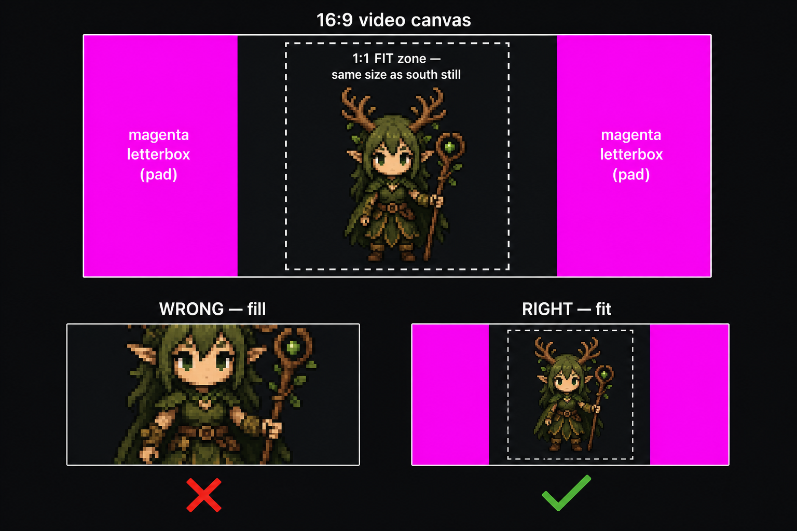

# Google Flow — Rimwalker Production Cheat Sheet

**Warcrest · line units (192px) + Aelindra hero (256px) · grab-and-go reference**

Full specs: [`rimwalker_unit_production_spec.md`](./rimwalker_unit_production_spec.md) · [`aelindra_animation_manifest.md`](./aelindra_animation_manifest.md) · post-process: [`animation_workflow_flowsheet.md`](./animation_workflow_flowsheet.md)

**Exact copy-paste prompts for every step:** [`google_flow_prompt_script.md`](./google_flow_prompt_script.md) — **v2: one fully built prompt per step** (Positive + Negative + Flow settings; videos include 1:1 framing line baked in).

---

## Table of contents

1. [Master prompt](#master-prompt)
2. [Quick reference](#quick-reference)
3. [Google Flow settings](#google-flow-settings)
4. [Google Flow checklist](#google-flow-checklist)
5. [Shared rules](#shared-rules)
6. [Root Tender](#root-tender-pawn)
7. [Bramble Archer](#bramble-archer-archer)
8. [Sapling Mystic](#sapling-mystic-monk)
9. [Thornguard](#thornguard-warrior)
10. [Aelindra Ashveil](#aelindra-ashveil-hero)
11. [Post-Flow pipeline](#post-flow-pipeline)

---

## Master prompt

**Paste this block into every Google Flow generation**, then append the unit-specific bullets from each section below (identity, props, prompt anchor).

**How to use:** `Master prompt` → replace `{slots}` → add per-unit south prompt / ability add-on from this sheet.

### Base prompt (all units + hero)

```
Rimwalker {UNIT_NAME}, {UNIT_DESCRIPTION}. Warcrest RTS pixel art, Valdris/Aelindra faction idiom: heavy chibi proportions, high top-down 3/4 camera (~45–60°), crown or hood top readable, feet near frame bottom. Selective thick outline #110509 on outer silhouette only — not blanket black on every fold. Stipple/dither shading on round forms, no smooth gradients, no photoreal lighting. Palette family only: warm bark browns (#2a1412–#764126), deep green shadows (#0b130c, #366431), leaf midtones (#46534a), pale cloth highlights (#95a17e, #a9ac9e), amber accent #a36940 on gems and power moments only — no blue, no gold, no sky fill. {SCALE_NOTE} Character centered, fills 85–90% frame height, tight crop. Flat solid magenta background #FF00FF, no shadow on backdrop, no floor plane, no vignette. {DIRECTION} facing. {POSE_TYPE}. Match Rimwalker faction read and existing south anchor framing; keep prop in the same hand across all directions.
```

### Variable slots

| Slot | Idle anchor (static / 4-dir) | Attack / cast video |
|------|------------------------------|---------------------|
| `{UNIT_NAME}` | e.g. `sapling mystic` | same |
| `{UNIT_DESCRIPTION}` | Identity + one prop read — from per-unit section | + ability pose note from per-unit or Aelindra table |
| `{DIRECTION}` | `south` · `north` · `east` · `west` | `south` (single-facing strips) |
| `{POSE_TYPE}` | `static idle anchor pose, no spell effects, no motion blur, no particles, no VFX from hands` | `animated attack/cast sequence, 6–8 frames, body motion only, no baked VFX in clip, grounded body motion only` |
| `{SCALE_NOTE}` | Line units: `Chibi line unit, slightly less head mass than hero Aelindra.` Hero: `Hero scale, full Tendkeeper presence, 256px export target.` | same |

**Prop hand rule:** Lock which hand holds the primary prop (shovel, bow, staff, mace, shield) per unit — never swap hands between directions or frames.

### Negative prompt (paste every time)

```
photorealistic, 3D render, CGI, smooth gradients, airbrush, anime cel shading, blue sky, ocean blue, gold trim, yellow metal, bright white highlights, extra limbs, wrong prop hand, swapped hands, spell VFX from hands (idle anchors), motion blur, depth of field, drop shadow on background, floor shadow on magenta, white background, green screen fringe, gradient background, text, watermark, logo, tiny character, cropped head, cropped feet, low angle, side-scroller camera, isometric without top-down read
```

For **idle anchors**, also add: `particles, spell effects, roots from hands, fire from hands, glow aura`.

For **attack/cast video** (body-only clips): add `VFX spawning from hands` when power should come from ground/target (Aelindra rule).

### Example — Sapling Mystic, south idle (filled)

**Positive:**

```
Rimwalker sapling mystic, dark skin, black braided hair, pointed ears, antler crown, green leaf mantle, dark green tunic, belt pouches, gnarled wooden staff with amber gem and leaf tip held vertical. Warcrest RTS pixel art, Valdris/Aelindra faction idiom: heavy chibi proportions, high top-down 3/4 camera (~45–60°), crown or hood top readable, feet near frame bottom. Selective thick outline #110509 on outer silhouette only — not blanket black on every fold. Stipple/dither shading on round forms, no smooth gradients, no photoreal lighting. Palette family only: warm bark browns (#2a1412–#764126), deep green shadows (#0b130c, #366431), leaf midtones (#46534a), pale cloth highlights (#95a17e, #a9ac9e), amber accent #a36940 on gems and power moments only — no blue, no gold, no sky fill. Chibi line unit, slightly less head mass than hero Aelindra. Character centered, fills 85–90% frame height, tight crop. Flat solid magenta background #FF00FF, no shadow on backdrop, no floor plane, no vignette. south facing. static idle anchor pose, no spell effects, no motion blur, no particles, no VFX from hands. Match Rimwalker faction read and existing south anchor framing; keep staff in the same hand across all directions. Simpler cloak than hero Aelindra.
```

**Negative:** use the [negative prompt block](#negative-prompt-paste-every-time) above (idle variant).

---

## Quick reference

| Unit | Role | Engine slot | Frame size | Idle frames* | South ref path |
|------|------|-------------|------------|--------------|----------------|
| **Root Tender** | Worker / gatherer | `pawn` | **192×192** | 8 | `assets/heroes/rimwalker/_refs/units/root_tender.png` |
| **Bramble Archer** | Ranged | `archer` | **192×192** | 6 | `assets/heroes/rimwalker/_refs/units/bramble_archer.png` |
| **Sapling Mystic** | Support / caster | `monk` | **192×192** | 6 | `assets/heroes/rimwalker/_refs/units/Sapling Mystic/sapling_mystic_South Facing.png` |
| **Thornguard** | Melee / tank | `warrior` | **192×192** | 8 | `assets/heroes/rimwalker/_refs/units/Thornguard/thornguard.png` |
| **Aelindra** | Hero / Tendkeeper | `aelindra` | **256×256** | 8 | `assets/heroes/rimwalker/aelindra/_refs/canonical_idle_keyed.png` |

\*Idle frame counts mirror Aurex defaults in `src/ui.js` until Rimwalker-specific defs ship.

**Other refs on disk**

| Unit | Extra direction refs |
|------|------------------------|
| Sapling Mystic | `…/Sapling Mystic/sapling_mystic_{North,East,West} Facing.png` |
| All units | PSD sources alongside PNGs in `_refs/units/` |

---

## Google Flow settings

| Setting | Image (anchors) | Video (walk / attack) |
|---------|-----------------|------------------------|
| Mode | **Image** | **Video** |
| Aspect ratio | **1:1** | **4:3** (preferred) or **16:9** — Flow has no 1:1 video; see [Video in a 1:1 frame](#video-in-a-11-frame-match-image-dimensions) |
| Multiplier | **x3** south only · **x1** W/E/N and all clips | **x1** |
| Canvas target | **1024×1024** | Same **1024×1024** after ffmpeg pad (must match image anchors) |
| Background | **#FF00FF magenta** (flat, no shadow on backdrop) | Same |
| Framing | Character fills **~90% frame height** (images only) | **Scale-to-fit** inside centered 1:1 safe zone — same scale as south still; magenta letterbox on sides |
| Camera | High top-down 3/4 (~45–60°); see crown/hood top, feet tucked | Same |
| Reference | South PNG for W/E/N | **Upload south idle as Image 1** so motion matches still framing |

### Video in a 1:1 frame (match image dimensions)

Flow exports video as **4:3 or 16:9**, but every frame must land in the **same 1024×1024 square** as your 1:1 image anchors. Treat the video as a wide canvas with a **centered 1:1 safe zone**:

```
┌─────────────────────────────────────┐  ← 4:3 or 16:9 video canvas
│ magenta │   1:1 FIT zone (center)  │ magenta │
│ letterbox│  character at SAME scale │ letterbox│
│          │  as south still — NOT   │         │
│          │  zoomed to fill width    │         │
└─────────────────────────────────────┘
```

**Fit, not fill.** The character stays the same size as the south image inside the center square. Magenta bars pad the sides — never scale the character up to fill the wide video frame.



**In Flow (every video prompt)** — append after the unit/ability prompt:

```
Scale-to-fit inside a centered 1:1 square matching the south idle image — identical character scale as Image 1, same foot baseline, same headroom. Full body head to feet fits inside the square with margin; do not zoom in, do not scale up to fill the wide canvas, do not crop head or feet. Flat magenta #FF00FF letterbox bars on left and right of the 1:1 safe zone. No zoom change, no reframing between frames, no camera move.
```

**Flow UI:** Video · **4:3** (closest to square) or **16:9** · **x1** · **Image 1 = approved south PNG**.

**After export — ffmpeg pads to 1024×1024** (same dimensions as image anchors):

```bash
# Square pad: scale to fit inside 1024², magenta fill — use for ALL video clips
ffmpeg -i clip.mp4 -ss 0.1 -t 1.0 \
  -vf "fps=8,scale=1024:1024:force_original_aspect_ratio=decrease:flags=lanczos,pad=1024:1024:(ow-iw)/2:(oh-ih)/2:color=0xFF00FF" \
  frames/frame_%02d.png
```

**Verify before pixelize:** Open `frame_01.png` beside your south idle — character height and foot position should match. If video character is smaller, re-prompt with “same scale as Image 1” or crop tighter in Flow.

**Video → frames (frame counts)**

```bash
# Walk / idle loop — 8 frames
ffmpeg -i unit_walk_south.mp4 -ss 0.1 -t 1.0 \
  -vf "fps=8,scale=1024:1024:force_original_aspect_ratio=decrease:flags=lanczos,pad=1024:1024:(ow-iw)/2:(oh-ih)/2:color=0xFF00FF" \
  frames/south_%02d.png

# Attack/cast — trim to manifest frame count (4/5/6/10)
ffmpeg -i aelindra_attack.mp4 -ss 0.1 -t 1.0 \
  -vf "fps=4,scale=1024:1024:force_original_aspect_ratio=decrease:flags=lanczos,pad=1024:1024:(ow-iw)/2:(oh-ih)/2:color=0xFF00FF" \
  frames/attack_%02d.png
```

Stitch horizontal strip: `convert +append frame_*.png strip.png` → sprite-tool.

---

## Google Flow checklist

Per **line unit** (repeat for each of 4 units):

- [ ] **South anchor first** — static pose or short idle loop on magenta 1024²; use south ref + prompt anchor below
- [ ] **Key south in sprite-tool** → Unit preset **192** → pixelize → save as canonical south
- [ ] **West / East / North** — generate from south anchor (same framing, same palette); import as 4-dir strip OR individual PNGs
- [ ] **Walk video** (optional) — 6–8 frames, magenta bg → ffmpeg → 4-dir or animation strip
- [ ] **Attack video** (when ready) — 4–6 frames, single south-facing strip; engine slot mirrors Aurex attack pattern
- [ ] Export **192×192** horizontal idle strip → `assets/units/rimwalker/<Unit>_Idle.png`

Per **Aelindra**:

- [ ] South idle anchor → `canonical_idle` quality pass
- [ ] Walk 4-dir (8 frames each dir) OR pixellab walk manifest
- [ ] **Root Lash** body video → 4 frames, impact on frame 2 (`Aelindra_Attack.png`)
- [ ] **Root Lash VFX** video → 6 frames (`RootLash_VFX.png` @ target feet) — sprite-tool **VFX · keyed** preset (pixelize optional) · see `google_flow_prompt_script.md` Step 7.1a
- [ ] **Thornwall** cast → 6 frames, impact frame 3
- [ ] **Verdant Pulse** cast → 5 frames, impact frame 2
- [ ] **The Ashfall** ult → 10 frames, impact frame 9
- [ ] Hit (2f) + Death (6f) last
- [ ] VFX strips separate (never bake roots/fire into body clip)

---

## Shared rules

### Palette (locked)

Source: [`aelindra_palette.json`](./aelindra_palette.json) · sprite-tool **Warcrest / Aelindra ship palette**

| Hex | Use |
|-----|-----|
| `#110509` | Outline / shadow (canonical outline) |
| `#0a1013` | Cool shadow |
| `#0b130c` | Deep green shadow |
| `#2a1412` `#3c1f17` `#481e16` `#59382d` | Bark shadows → warm |
| `#764126` `#7f6657` | Skin / bark mid |
| `#46534a` `#366431` | Leaf ash / mid |
| `#a36940` | **Amber accent** (gems, power moments only) |
| `#95a17e` `#a9ac9e` | Pale cloth / highlight |

No blue, no gold, no sky-origin light. Amber = power beats only.

### Style (Aelindra parity)

- **Outline** — 1px selective `#110509` (not blanket black on folds)
- **Shading** — stipple/dither on round forms; no smooth gradients
- **Proportions** — heavy chibi; units = slightly less head mass than Aelindra
- **Silhouette** — one readable prop per unit (shovel, bow, staff, mace+shield)
- **Hero vs unit canvas** — Aelindra **256px** · line units **192px** (~25% smaller)

### Framing

- Flow output: **90% height fill**, centered horizontally
- sprite-tool scale lock: **south bbox** (4-dir) or **frame 0 bbox** (animation strips)
- Export: square frames in horizontal row — `stripWidth = frameCount × frameHeight`

---

## Root Tender (`pawn`)

**Role:** Worker / gatherer · **Engine:** `pawn` · **Export:** 192×192 · **Idle:** 8 frames → 1536×192 strip

### Identity

Elder gatherer, dark skin, grey spiky hair, small branch antlers. Leaf tunic, bark-textured arms, brown boots.

### Silhouette bullets

- Shovel in **right hand**
- Woven **root basket** on back with amber gems
- Antlers + basket = instant read at battlefield zoom

### Prop / hand rules

| Hand | Prop |
|------|------|
| Right | Shovel (working tool, angled down or on shoulder) |
| Back | Basket — never obscures head silhouette |

### South prompt (Google Flow)

> Rimwalker root tender, gatherer worker, shovel and root basket, dark skin, grey spiky hair, branch antlers, leaf tunic, bark arms, high top-down 3/4 chibi pixel, same palette as Aelindra faction, magenta background #FF00FF, character fills 90% of frame

**Prompt anchor:** *"Rimwalker root tender, gatherer worker, shovel and root basket, same palette as Aelindra faction"*

### Paths

| Asset | Path |
|-------|------|
| South ref | `assets/heroes/rimwalker/_refs/units/root_tender.png` |
| Source PSD | `assets/heroes/rimwalker/_refs/units/root_tender.psd` |
| Shipped strip (target) | `assets/units/rimwalker/RootTender_Idle.png` |

---

## Bramble Archer (`archer`)

**Role:** Ranged · **Engine:** `archer` · **Export:** 192×192 · **Idle:** 6 frames → 1152×192 strip

### Identity

Hooded archer, face in shadow, amber forehead gem. Green leaf pauldrons, wood breastplate, grey sash.

### Silhouette bullets

- **Wooden bow** — right hand
- **Quiver** — left shoulder
- Hood peak + bow arc = primary read

### Prop / hand rules

| Hand / slot | Prop |
|-------------|------|
| Right | Bow (partial draw or at rest — consistent across dirs) |
| Left shoulder | Quiver — visible from south |

### South prompt (Google Flow)

> Rimwalker bramble archer, green hood, face in shadow, amber forehead gem, leaf pauldrons, wood breastplate, grey sash, wooden bow right hand quiver left shoulder, high top-down 3/4 chibi pixel, Aelindra faction palette, magenta background #FF00FF, 90% height fill

**Prompt anchor:** *"Rimwalker bramble archer, green hood, leaf armor, wooden bow, high top-down pixel"*

### Paths

| Asset | Path |
|-------|------|
| South ref | `assets/heroes/rimwalker/_refs/units/bramble_archer.png` |
| Source PSD | `assets/heroes/rimwalker/_refs/units/bramble_archer.psd` |
| Shipped strip (target) | `assets/units/rimwalker/BrambleArcher_Idle.png` |

---

## Sapling Mystic (`monk`)

**Role:** Support / caster · **Engine:** `monk` · **Export:** 192×192 · **Idle:** 6 frames → 1152×192 strip

### Identity

Dark skin, black braided hair, pointed ears, **antler crown**. Green leaf mantle, dark green tunic, belt pouches. Closest to Aelindra — simplify: no hero-scale cloak volume, smaller staff read.

### Silhouette bullets

- **Gnarled staff** with amber gem + green leaf tip
- Antler crown + staff vertical = caster read
- Smaller / simpler cloak than Aelindra

### Prop / hand rules

| Hand | Prop |
|------|------|
| Both / one | Staff planted or held vertical — gem at top, leaf tip visible |
| Belt | Pouches — secondary detail only |

### South prompt (Google Flow)

> Rimwalker sapling mystic support caster, dark skin, black braided hair, pointed ears, antler crown, green leaf mantle, dark green tunic, gnarled wooden staff with amber gem and leaf tip, high top-down 3/4 chibi pixel, Aelindra faction palette, magenta background #FF00FF, 90% height fill, simpler cloak than hero Aelindra

**Prompt anchor:** *"Rimwalker sapling mystic support caster, antler crown, leaf cloak, wooden staff, chibi pixel"*

### Paths

| Asset | Path |
|-------|------|
| South ref | `assets/heroes/rimwalker/_refs/units/Sapling Mystic/sapling_mystic_South Facing.png` |
| Other dirs | `…/sapling_mystic_{North,East,West} Facing.png` |
| Source PSD | `assets/heroes/rimwalker/_refs/units/Sapling Mystic/sapling_mystic.psd` |
| Shipped strip (target) | `assets/units/rimwalker/SaplingMystic_Idle.png` |

---

## Thornguard (`warrior`)

**Role:** Melee / tank · **Engine:** `warrior` · **Export:** 192×192 · **Idle:** 8 frames → 1536×192 strip

### Identity

Broad male, dark skin, beard, dreads, wooden helm with amber gem. Full bark plate armor, green leaf skirt, teal cape.

### Silhouette bullets

- **Spiked wooden mace** + round **leaf shield** (amber center)
- Widest unit — shield arc + cape bulk

### Prop / hand rules

| Hand | Prop |
|------|------|
| Right | Spiked wooden mace |
| Left | Round leaf shield — amber gem center, held forward |

### South prompt (Google Flow)

> Rimwalker thornguard tank, broad male dark skin beard dreads, wooden helm amber gem, bark plate armor, green leaf skirt, teal cape, spiked wooden mace right hand round leaf shield with amber center left hand, chunky high top-down 3/4 chibi pixel, Aelindra faction palette, magenta background #FF00FF, 90% height fill

**Prompt anchor:** *"Rimwalker thornguard tank, wooden bark armor, leaf shield, wooden mace, chunky chibi pixel"*

### Paths

| Asset | Path |
|-------|------|
| South ref | `assets/heroes/rimwalker/_refs/units/Thornguard/thornguard.png` |
| Source PSD | `assets/heroes/rimwalker/_refs/units/Thornguard/thornguard.psd` |
| Shipped strip (target) | `assets/units/rimwalker/Thornguard_Idle.png` |

---

## Aelindra Ashveil (hero)

**Role:** Tendkeeper hero · **Engine:** `aelindra` · **Export:** **256×256** · **Faction:** rimwalker (not yet playable)

**Core rule:** Power comes from the **ground at destination** — never from her hands. Body strips = pose animation; VFX = separate strips spawned at `impactFrame`.

### South / idle refs

| Asset | Path |
|-------|------|
| Canonical idle (keyed) | `assets/heroes/rimwalker/aelindra/_refs/canonical_idle_keyed.png` |
| Canonical idle | `assets/heroes/rimwalker/aelindra/_refs/canonical_idle.png` |
| Pixellab south | `assets/heroes/rimwalker/aelindra/_refs/pixellab_character_south.png` |
| Walk sheet | `assets/heroes/rimwalker/aelindra/_refs/walk.png` |
| Shipped folder | `assets/heroes/rimwalker/aelindra/` |

### Abilities + animation clips

From `src/sprites.js` + `src/heroes.js` + [`aelindra_animation_manifest.md`](./aelindra_animation_manifest.md):

| Clip | Ability / action | File | Frames | fps/speed | impactFrame | Body description | VFX (separate) |
|------|------------------|------|--------|-----------|-------------|------------------|----------------|
| **attack** | Root Lash (basic attack) | `Aelindra_Attack.png` | **4** | fps 12 | **2** | Staff-base taps ground | `RootLash_VFX.png` @ target feet (6f) |
| **cast_thornwall** | Thornwall (Lv1, CD 14s) | `Aelindra_Thornwall.png` | **6** | fps 10 | **3** | Staff press into ground; wall line spawn | `Thornwall_VFX.png` (8f) — blocks movement 8s |
| **cast_verdant** | Verdant Pulse (Lv3, CD 20s) | `Aelindra_Verdant.png` | **5** | fps 8 | **2** | Posture collapse / communion | `Verdant_VFX.png` (7f) @ her feet — heal 45 / dmg 45 in 300px |
| **cast_ashfall** | The Ashfall (Lv5, CD 55s) | `Aelindra_Ashfall.png` | **10** | fps 8 | **9** | Raise staff → tremble → release (3s cast) | `Ashfall_VFX.png` (12f) @ radius — 300 dmg + silence 5s |
| idle | — | `Aelindra_Idle.png` | **8** | speed 4 | — | Breathing, staff planted | — |
| walk | — | `Aelindra_Run.png` or pixellab 4-dir | **8** | speed 10 | — | Low grounded gait | — |
| guard | — | reuse idle | **8** | speed 2.5 | — | Slower idle | — |
| hit | — | `Aelindra_Hit.png` | **2** | fps 12 | — | Flinch, no knockback (passive) | — |
| death | — | `Aelindra_Death.png` | **6** | fps 8 | — | Sinks/settles, hold last | — |

### Cast ref images (Flow / pose guides)

| Clip | Ref path |
|------|----------|
| Root Lash | `assets/heroes/rimwalker/aelindra/_refs/attack_root_lash.png` |
| Thornwall | `assets/heroes/rimwalker/aelindra/_refs/cast_thornwall.png` |
| Verdant Pulse | `assets/heroes/rimwalker/aelindra/_refs/cast_verdant.png` |
| The Ashfall | `assets/heroes/rimwalker/aelindra/_refs/cast_ashfall.png` |

### Aelindra Flow prompts (append to every clip)

Use the **[master prompt](./google_flow_cheat_sheet.md#master-prompt)** with `{SCALE_NOTE}` = hero line and `{POSE_TYPE}` from the ability add-on below. Legacy one-liner:

> Aelindra Ashveil, oldest Rimwalker Tendkeeper, Sylhen, dark skin, antler crown, leaf cloak, gnarled staff, heavy chibi Valdris pixel style, high top-down 3/4, selective outline stipple dither, Aelindra faction palette amber accent only on power moments, magenta background #FF00FF, character 90% frame height

**Ability-specific add-ons:**

| Clip | Add to prompt |
|------|---------------|
| Root Lash | staff base tapping ground strike pose, no roots from hands |
| Thornwall | staff pressed into ground, defensive wall cast |
| Verdant Pulse | posture collapse communion with earth, healing pulse |
| The Ashfall | staff raised vertical, trembling, ultimate release — catastrophic ash memory |

### Strip sizes (256px frames)

| Clip | Strip dimensions |
|------|------------------|
| Idle / Run (8f) | **2048×256** |
| Attack (4f) | **1024×256** |
| Thornwall (6f) | **1536×256** |
| Verdant (5f) | **1280×256** |
| Ashfall (10f) | **2560×256** |
| Hit (2f) | **512×256** |
| Death (6f) | **1536×256** |
| Portrait | **256×256** single |

---

## Post-Flow pipeline

Full detail: **[`animation_workflow_flowsheet.md`](./animation_workflow_flowsheet.md)**

```
Google Flow (1024² magenta) → ffmpeg frames → sprite-tool.html
  → Apply Key (#FF00FF flood fill)
  → Unit · 192  OR  Hero · 256
  → Pixelize (Warcrest palette)
  → Export direction strip OR animation strip
  → assets/units/rimwalker/  OR  assets/heroes/rimwalker/aelindra/
  → wire src/sprites.js
```

| Tool | Path |
|------|------|
| Sprite tool | `~/ComfyUI-Sprites/sprite-tool/sprite-tool.html` |
| Tool docs | `~/ComfyUI-Sprites/sprite-tool/CLAUDE.md` |
| Unit spec | `docs/art/rimwalker/rimwalker_unit_production_spec.md` |
| Hero manifest | `docs/art/rimwalker/aelindra_animation_manifest.md` |
| Palette JSON | `docs/art/rimwalker/aelindra_palette.json` |
| Engine defs | `src/sprites.js` · `src/heroes.js` |

**Preset cheat:** Line units → grid **48**, export **192**. Hero → grid **64**, export **256**. If soft, bump unit grid to **64**.
